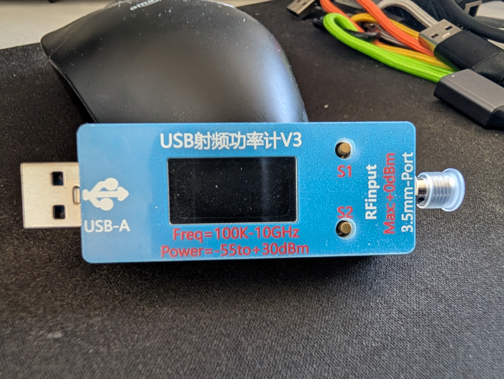

# rfmeter

A native Linux desktop "cockpit" for the Chinese USB RF Power Meter V3
(USB VID `0483` / PID `5740`, enumerates as a STM32 CDC ACM virtual
serial port at 921600 baud).



The meter streams a single scalar power reading; this app shows it as
a big numeric readout, a rolling 60 s time-series plot, a histogram of
recent samples, and exposes the meter's 8 calibration "bands" with
per-band frequency + offset.

## Build & run

```bash
go build -ldflags="-s -w" -o rfmeter ./cmd/rfmeter
./rfmeter
```

Requires:
- Go 1.22+ (1.25+ pulled in transitively by `go.bug.st/serial`)
- System libs (Debian/Ubuntu): `libxkbcommon-x11-dev libx11-xcb-dev`
  (plus the normal X11 / Wayland / EGL devel packages Gio needs)
- User in the `dialout` group to read `/dev/ttyACM*`

## Tests

```bash
go test ./...
```

Parser, ring buffer, stats/histogram, and CSV logger have unit
coverage. The UI is verified manually against the live meter.

## How it works

- **Auto-detect**: on startup the app enumerates USB serial ports and
  connects to the first one matching the meter's VID/PID. If you
  unplug, the status dot turns red and a 1 s ticker reconnects on
  replug.
- **Bands (F3–F10)**: the meter has 8 calibration entries, each with
  a frequency (MHz) and offset (dB). Pre-populated with the factory
  defaults (100, 200, 300, 400, 1000, 2000, 5000, 6000 MHz) on first
  launch; refreshed from the meter on connect. Clicking a band button
  (or pressing its F-key) re-sends the stored config to the meter,
  which switches its active calibration to that band.
- **Edit band**: type a new freq / offset and click Apply to update
  the currently selected band on the meter.
- **Sample rate (S0/S1/S2)**: slow / medium / fast — sent to the
  meter as a serial command.
- **CSV log (F11)**: writes `rfmeter_YYYYMMDD_HHMMSS.csv` to CWD with
  `time_iso,dbm,linear_w,unit,page` columns. Toggle to stop.
- **PNG snapshot (F12)**: saves a 1920×1080 image of the current
  cockpit (readout + plot + histogram + stats).
- **Attenuator helper (F2)**: given expected signal power and the
  meter's max safe input (default 0 dBm), computes the attenuation
  you need to add. Apply writes that as the current band's offset.

## Keyboard

| Key | Action |
|---|---|
| F1 | Help modal |
| F2 | Attenuator helper |
| F3..F10 | Select band |
| F11 | Toggle CSV log |
| F12 | Save PNG snapshot |
| Space | Pause / resume the time-series plot |
| Esc | Close any open modal |

## Project layout

```
cmd/rfmeter/      main, wires Controller + Gio window
internal/meter/   serial I/O, frame parser, config parser
internal/state/   ring buffer of frames, rolling stats, CSV log
internal/ui/      Gio cockpit, widgets, modals, snapshot rendering
docs/             spec, plan, device photo, vendor docs
```

## Protocol notes

- Streaming frame is 12 ASCII bytes: `a±DDDLLLLL[uwm]A`
  - `±DDD` = dBm × 10 (e.g. `-392` = -39.2 dBm)
  - `LLLLL` = linear power × 100
  - unit byte: `u` µW, `m` mW, `w` W
  - example: `a-39200011uA` = -39.2 dBm = 0.11 µW
- Commands end with `\r\n`:
  - `S0`/`S1`/`S2` — sample rate
  - `<A-H><freq><±off.o>` — set/activate band (e.g. `A2400+10.0`)
  - `Read` — dump current 8-band config as `R<freq><±off.o>` × 8
- The firmware echoes recent host writes back into the stream; the
  parser is garbage-tolerant.

Vendor's original docs are in `docs/rfmeter_doc.txt` (plain text
extract) and `rf_power_meter_100khz_to10Ghz/Dock/USB-RF-Power-Meter.docx`
(extracted from the vendor zip).
