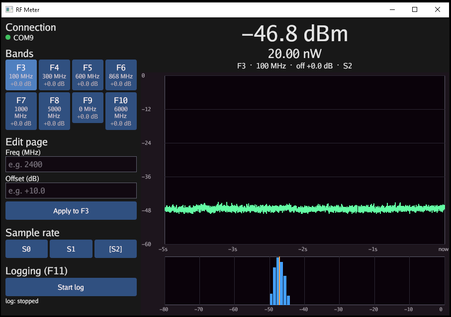

# Building rfmeter on Windows

The code is cross-platform — Gio (GUI), `go.bug.st/serial` (serial
I/O), and `fogleman/gg` (PNG snapshots) all support Windows. None of
the Linux system libraries from the README (`libxkbcommon`, X11,
Wayland, EGL) are needed: Gio links directly against the Windows
graphics stack.



## Prerequisites

- **Go 1.22+** (1.25+ is pulled in transitively by `go.bug.st/serial`).
  Install from <https://go.dev/dl/>.
- **STM32 Virtual COM Port driver.** On Windows 10/11 the meter's
  CDC-ACM interface is recognised automatically and shows up as a
  `COMx` port — no driver install or special permissions (no
  `dialout`-group equivalent). On older Windows, install ST's
  *STSW-STM32102* VCP driver if the port doesn't appear.
- No build-time C toolchain is required — Gio's Windows backend uses
  syscalls, not CGO.

## Build & run

In PowerShell or `cmd`, from the repo root:

```powershell
go build -ldflags="-s -w" -o rfmeter.exe ./cmd/rfmeter
.\rfmeter.exe
```

`-ldflags="-s -w"` strips debug info to shrink the binary; drop it
while developing.

Or use the bundled PowerShell helper (no `make` required):

```powershell
.\build.ps1            # build rfmeter.exe (GUI subsystem, no console)
.\build.ps1 run        # build and run
.\build.ps1 test       # go test -race ./...
.\build.ps1 clean
```

If scripts are blocked by execution policy, run it as
`powershell -ExecutionPolicy Bypass -File .\build.ps1 <target>`.

### Hide the console window (optional)

A plain `go build` opens a console window alongside the GUI. To launch
without it, build as a GUI subsystem binary:

```powershell
go build -ldflags="-s -w -H=windowsgui" -o rfmeter.exe ./cmd/rfmeter
```

The `make windows` target (from the repo's Makefile) already builds with
`-H=windowsgui`, so the produced `rfmeter.exe` has no console window.

## Application icon

The Windows `.exe` carries an embedded icon (the green `RF` mark). It is
linked from `cmd/rfmeter/rfmeter_windows_amd64.syso` — Go automatically
includes `*_windows_amd64.syso` resource files when building for Windows,
and ignores them on every other platform.

To regenerate it after changing the artwork in `build/icon/`:

```bash
magick build/icon/rfmeter-256.png \
  -define icon:auto-resize=256,128,64,48,32,16 build/icon/rfmeter.ico
go run github.com/akavel/rsrc@latest \
  -ico build/icon/rfmeter.ico -arch amd64 \
  -o cmd/rfmeter/rfmeter_windows_amd64.syso
```

## Cross-compiling from Linux/macOS

You can produce the Windows binary without a Windows machine:

```bash
GOOS=windows GOARCH=amd64 go build -ldflags="-s -w" -o rfmeter.exe ./cmd/rfmeter
```

This works because the Windows build path is CGO-free.

## Differences from Linux

| | Linux | Windows |
|---|---|---|
| Serial device | `/dev/ttyACM0` | `COM3` (etc.) |
| Port access | user in `dialout` group | none needed |
| System libs | `libxkbcommon-x11-dev`, X11/EGL | none |
| Driver | in-kernel `cdc_acm` | STM32 VCP (auto on Win10+) |

Auto-detection is identical on both: the app matches the meter's USB
VID `0483` / PID `5740`, so it finds the right `COMx` port without any
configuration. CSV logs and PNG snapshots are written to the current
working directory, same as on Linux.
